# AC215 - Milestone 5 - TummyAI

**Team Members**
- Nicole Ye (jiarong_ye@hms.harvard.edu)
- Ningxi Huang (ningxi_huang@hms.harvard.edu)
- John Lin (john_lin@hms.harvard.edu)
- Stephanie Chen (stephanie_chen@hms.harvard.edu)

## Project Overview

TummyAI is an AI-powered food recognition app designed to help individuals with irritable bowel syndrome (IBS) manage their digestive health. The application uses a fine-tuned Vision Transformer (ViT) model to identify 658 food dishes from images and provide ingredient-level FODMAP analysis across 707 ingredients. Users can upload meal photos, track symptoms, and receive personalized insights for their food triggers.

### Repository Organization

```
├── .github/workflows/      # CI/CD pipeline
├── src/                    # Source code
│   ├── api-service/        # APIs
│   ├── data-version/       # Data versioning
│   ├── deployment/         # App deployment
│   └── frontend-react/     # Frontend
├── docs/                   # Additional documentation
├── images/                 # Images
└── README.md               # This file
```

### Solution Architecture

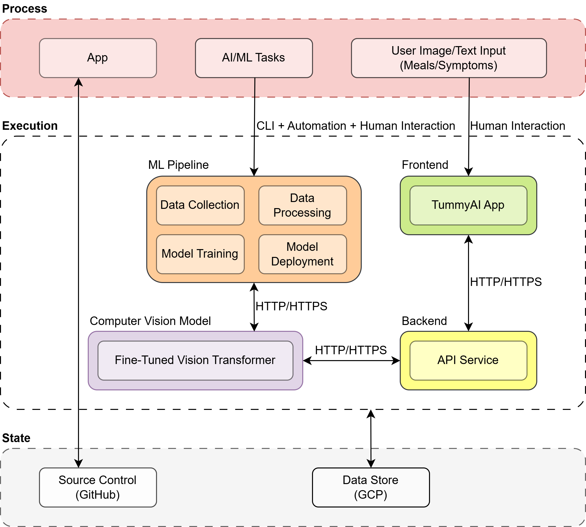

### Technical Architecture

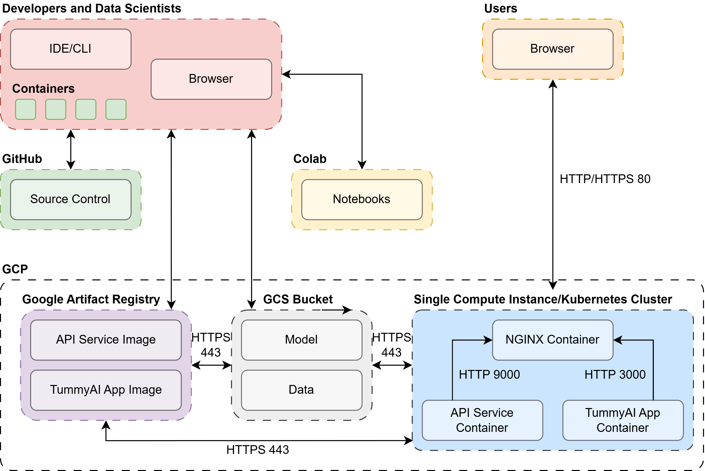

## Setup Instructions

### Prerequisites
- Install Docker
- Clone this repository
```bash
git clone https://github.com/Elococin/AC215_tummyai.git
```
- Setup up GCP credentials in a `secrets` directory

## Deployment Instructions

### APIs

1. Navigate to the `api-service` directory

```bash
cd src/api-service
```

2. Build and run the container.

```bash
sh docker-shell.sh
```

3. Start the API service.
```bash
uvicorn_server
```

4. View the API service at [http://localhost:9000](http://localhost:9000)

    You can also view an interactive API documentation at [http://localhost:9000/docs](http://localhost:9000/docs)

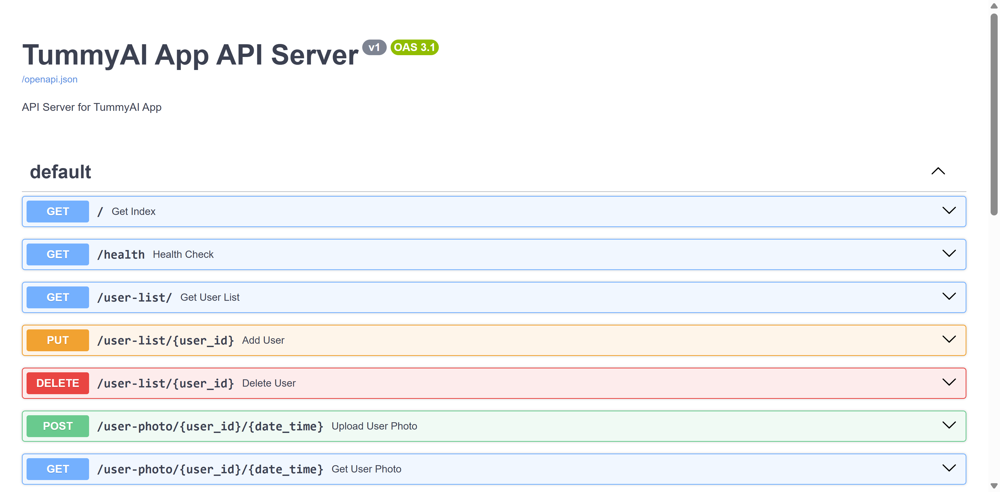

### Frontend

1. Navigate to the `frontend-react` directory.

```bash
cd src/frontend-react
```

2. Build and run the container.
```bash
sh docker-shell.sh
```

3. Install dependencies.
```bash
npm install
```

4. Start the development frontend server.
```
npm run dev
```

5. View the frontend at [http://localhost:3000](http://localhost:3000)

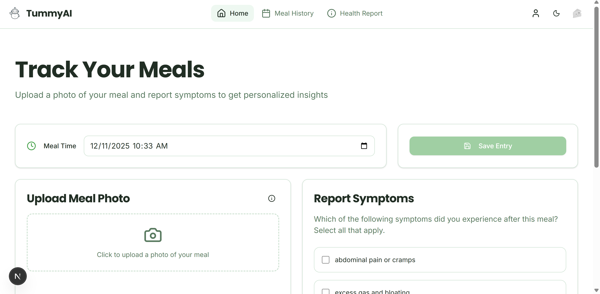

### Data Versioning

1. Navigate to the `data-version` directory.

```bash
cd src/data-version
```

2. Build and run the container.
```bash
sh docker-shell.sh
```

3. Inside the container, run:

```bash
dvc remote add -d gcs_data gs://tummyai-app-models/dvc_store
dvc pull
dvc add gcs_data
dvc push
```

4. Outside the container, run:

```bash
git status
git add .
git commit -m "DVC update"
git tag -a "dataset_v1" -m "tag dataset"
git push --atomic origin main dataset_v1
```

### Deployment

1. Navigate to the `deployment` directory.

```bash
cd src/deployment
```

2. Build and run the container.
```bash
sh docker-shell.sh
```

3. Build and push Docker images to Google Artifact Registry.

```bash
# Navigate to the `deploy_images` directory
cd deploy_images

# Set up Pulumi
pulumi stack init dev
pulumi config set gcp:project tummyai-ci-cd

# Build and push containers
pulumi up --stack dev --refresh -y
```

4. Deploy the application.

```bash
# Navigate to the `deploy_k8s` directory
cd deploy_k8s

# Set up Pulumi
pulumi stack init dev
pulumi config set gcp:project tummyai-ci-cd
pulumi config set security:gcp_service_account_email deployment@tummyai-ci-cd.iam.gserviceaccount.com --stack dev
pulumi config set security:gcp_ksa_service_account_email gcp-service@tummyai-ci-cd.iam.gserviceaccount.com --stack dev

# Create a Kubernetes cluster and deploy our containers
pulumi up --stack dev --refresh -y
```

## Usage Instructions

**URL:** [http://34.10.244.81.sslip.io/](http://34.10.244.81.sslip.io/)

### 🏠 Home Page

In the Home Page, users can upload a photo of their meal and report their symptoms. Our fine-tuned Vision Transformer model then analyzes the photo to identify the dish, ingredients, and overall FODMAP level.

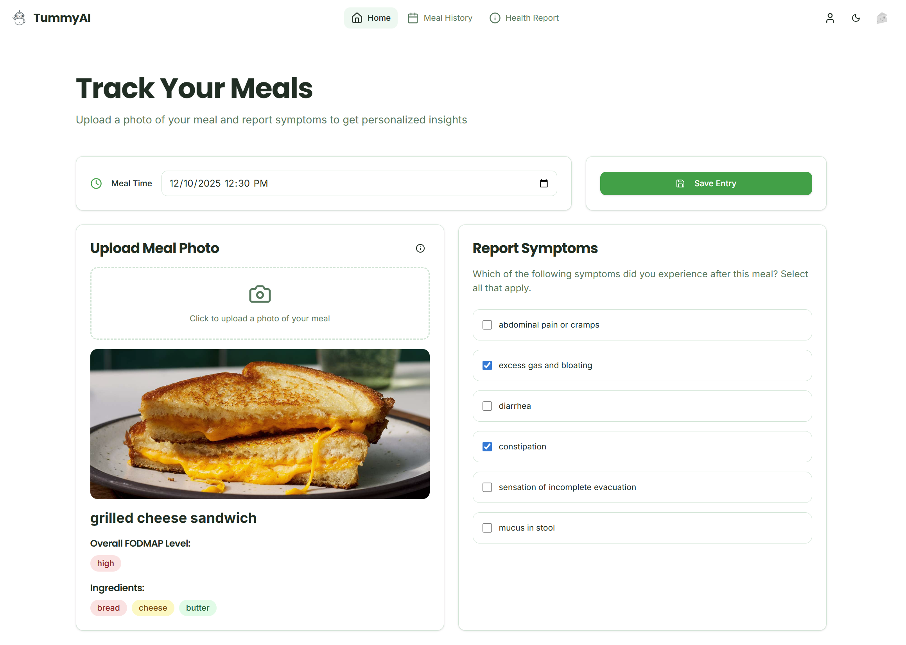

### 📆 Meal History Page

In the Meal History Page, users can view their most recent meals and symptoms. Ingredients with high, low, or no FODMAP content are highlighted in red, yellow, and green, respectively.

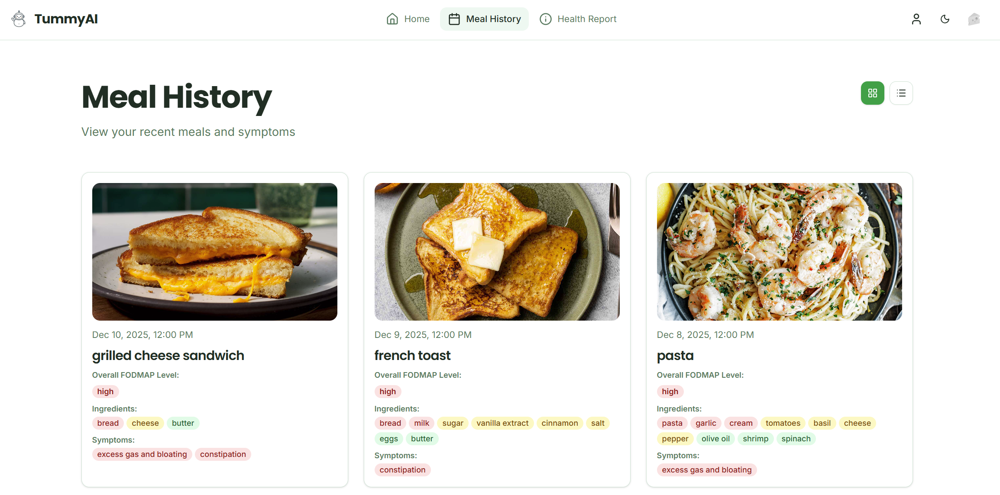

### ⓘ Health Report Page

In the Health Report Page, users can view trigger foods associated with their reported symptoms, as well as changes in these symptoms over time. In addition, our application uses Gemini to generate personalized recommendations based on user data.

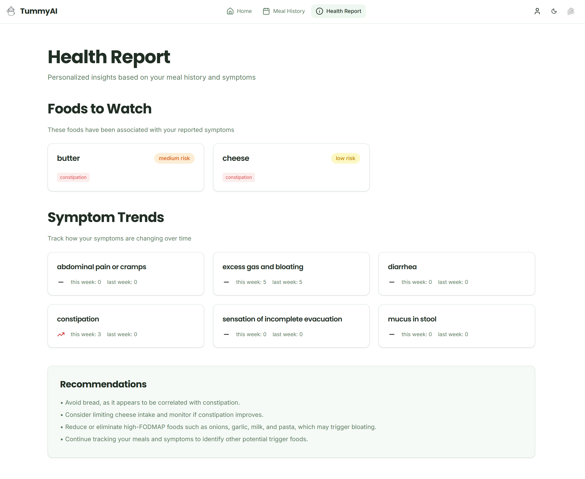

### 🧀 Cheese Mode

Try turning on Cheese Mode in the top right corner!

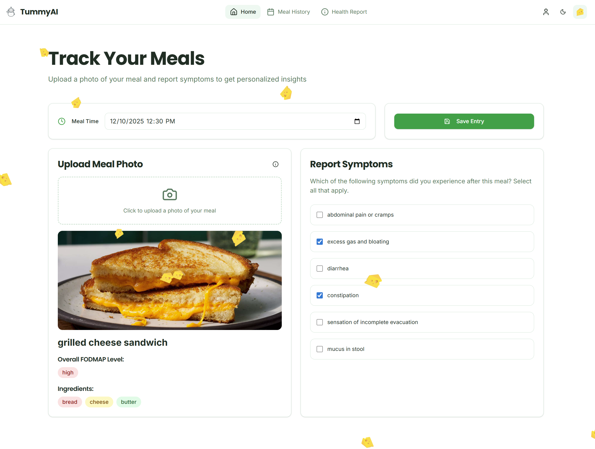

## Known Issues and Limitations

1. **Serverless ML Pipeline**

Due to the complexity of our ML pipeline, certain tasks (data collection, data processing, and model training) are performed manually. See the notebook for more details.

2. **Asynchronous User Input**

Currently, users are required to upload a meal photo and report their symptoms at the same time. In the future, we hope to allow users to report symptoms for previous meals in the Meal History Page.

3. **User Feedback**

At present, users are not able to edit the list of ingredients identified by our fine-tuned Vision Transformer model. We aim to implement this feature in both the Home and Meal History Pages.

## Additional Details (Technical Implementation)

### Kubernetes Deployment

Kubernetes demonstrates horizontal pod autoscaling behavior:

- Baseline: 2 pods
- Under load: Automatically scaled to 9 pods (memory at 132% of 80% target)
- Configuration: HPA monitors CPU (70% target) and memory (80% target)
- Range: 2-10 pods

**Autoscaling Behavior Demonstration:**

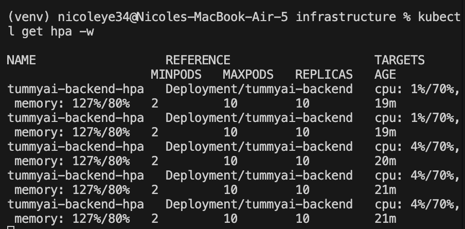

### Pulumi Infrastructure

Pulumi automates the provisioning and deployment of our infrastructure and application.

**Provisioning and Deployment Demonstration:**

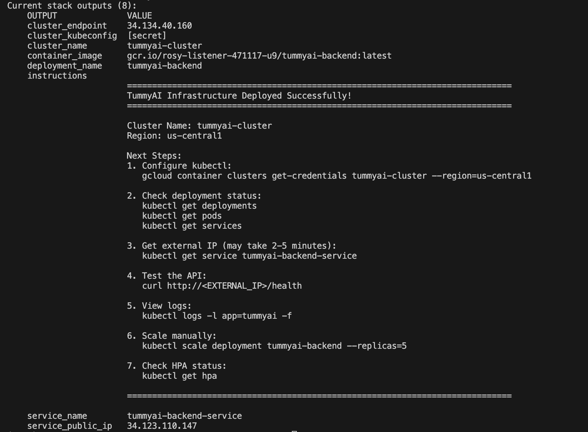

### CI Pipeline

Our Continuous Integration (CI) pipeline uses GitHub Actions to automate the following steps on push:

1. Build Docker image
2. Run linting and formatting checks
3. Run unit tests
4. Run integration tests
5. Run system tests

**CI Pipeline Workflow File:** `.github/workflows/ci.yml`

**CI Pipeline Screenshot**

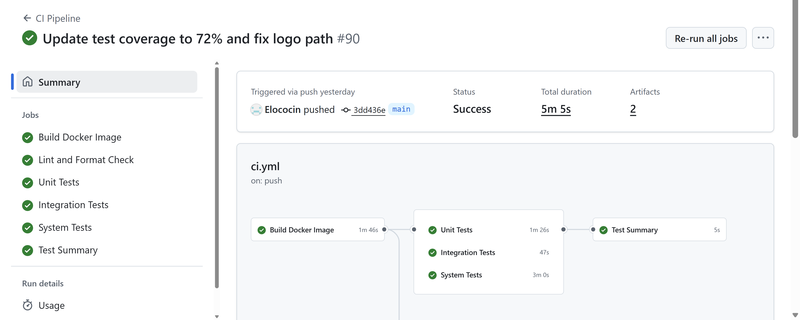

**CI Pipeline Coverage Report**

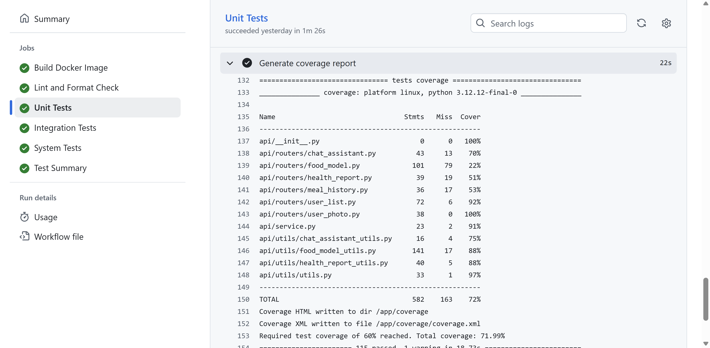

**Functions/Modules Not Covered:** `docs/TEST_COVERAGE.md`

### CD Pipeline

Our Continuous Deployment (CD) pipeline extends the CI pipeline:

1. Build Docker image
2. Run linting and formatting checks
3. Run unit tests
4. Run integration tests
5. Run system tests
6. Build and push Docker images to Google Artifact Registry
7. Deploy application

**CD Pipeline Workflow File:** `.github/workflows/cd.yml`

**CD Pipeline Screenshot**

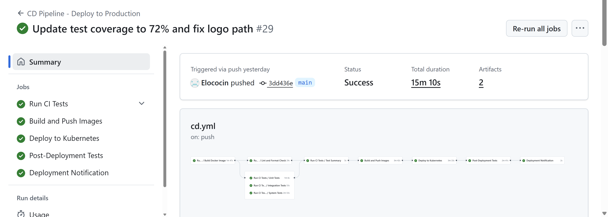

### ML Workflow
